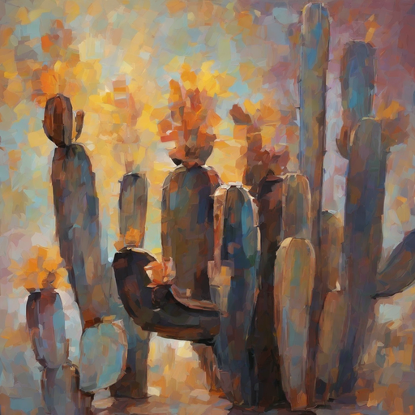
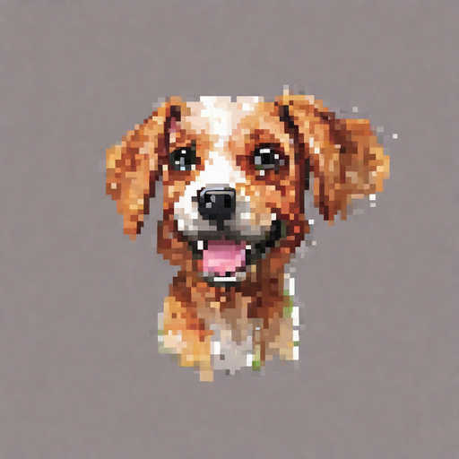

# 第四届计图人工智能挑战赛

## 赛道二-三等奖：风格迁移图像生成-StyleBooth

|风格参考图 | 生成图1 | 生成图2 | 生成图3|
|:--------: | :-----:|:-----:|:-----:|
 | ||
Cactus|Boat|Grass|Park
|||
Dog|Bed|Leaf|Stadium          
## 简介

本项目包含了第四届计图人工智能挑战赛 - 风格迁移图片生成（B榜）的代码实现。
本项目对参考的28种风格图片进行学习，在每种风格仅有3张参考图的条件下，设计了一套先生成，再风格注入的框架，其中风格注入模块是无训练的。
结果表明，对风格中特征的学习和主体的保留都取得了很好的效果。

## 环境配置

#### 运行设备及训练时间

本项目可在 1 张 4090 上运行，基础图片的训练时间约为 4 小时，推理出基础图片的时间约为 1.5 小时，对基础图片的风格调整，生成最终结果的时间大约为 4 小时，共计大约 9.5 小时。

#### 0.运行环境要求
- ubuntu 20.04 LTS
- python >= 3.9.0
- jittor >= 1.3.9.5
  
#### 1.创建虚拟环境
```
conda create -n jit python==3.9
conda activate jit
cd dreambooth
pip install -r requirements.txt
```

#### 2. Install JDiffusion

```
git clone https://github.com/JittorRepos/JDiffusion.git
cd JDiffusion
pip install -e .
```

#### 3. Install JTorch

安装JTorch版本的相关深度学习库：
```
pip install git+https://github.com/JittorRepos/jittor
pip install git+https://github.com/JittorRepos/jtorch
pip install git+https://github.com/JittorRepos/diffusers_jittor
pip install git+https://github.com/JittorRepos/transformers_jittor
```
## 训练(或用我们给出的ckpt以跳过训练)

#### 0.使用的基准stable-diffusion模型

使用的预训练模型为[stabilityai/stable-diffusion-2-1 at main (huggingface.co)](https://huggingface.co/stabilityai/stable-diffusion-2-1/tree/main)


#### 1.训练的风格集合

参考风格数据（Style_B）见https://cloud.tsinghua.edu.cn/f/4caf92b9ac6444659597/?dl=1

下载解压到目录 ./B 内.


#### 2.开始权重训练！

权重的训练可以运行以下命令：
```
cd stylebooth
bash train_all.sh
```

## 风格图像生成

一键生成结果可以运行以下命令：
```
python test.py
```

## 致谢
```
@inproceedings{ruiz2023dreambooth,
  title={Dreambooth: Fine tuning text-to-image diffusion models for subject-driven generation},
  author={Ruiz, Nataniel and Li, Yuanzhen and Jampani, Varun and Pritch, Yael and Rubinstein, Michael and Aberman, Kfir},
  booktitle={Proceedings of the IEEE/CVF conference on computer vision and pattern recognition},
  pages={22500--22510},
  year={2023}
}

@inproceedings{chung2024style,
  title={Style injection in diffusion: A training-free approach for adapting large-scale diffusion models for style transfer},
  author={Chung, Jiwoo and Hyun, Sangeek and Heo, Jae-Pil},
  booktitle={Proceedings of the IEEE/CVF Conference on Computer Vision and Pattern Recognition},
  pages={8795--8805},
  year={2024}
}
```

## 联系方式

如果有任何疑问请在issue中提出
